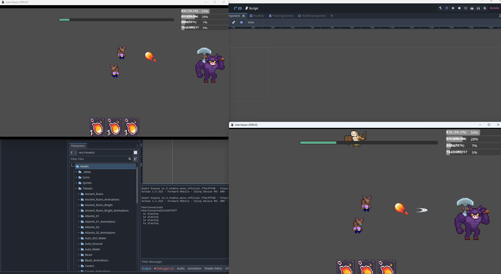
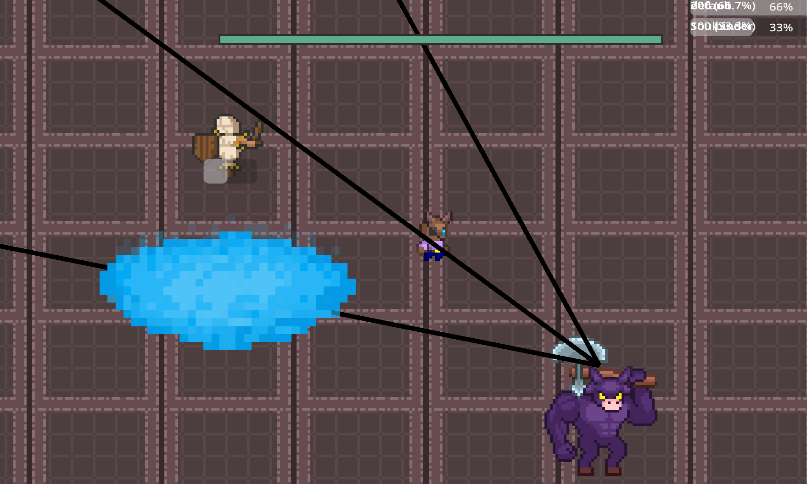
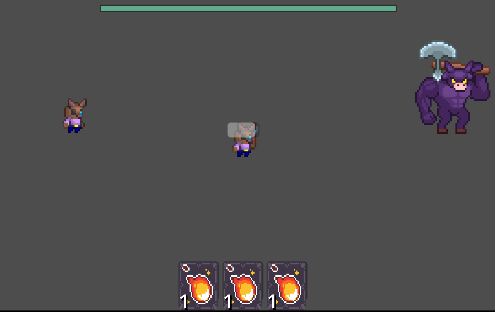

# Rift Runners Demo

A local multiplayer rogue-like. Choose a class, team up with friends on the same network, and fight through enemies while executing each class's unique mechanics. All art in this build is placeholder art.

## 🎮 Multiplayer

Host or join a game over your local network and play together.

## ✨ Features

### 🧑‍🤝‍🧑 Local Multiplayer
Host a session or join one over LAN.

### 🎯 Class-Based Mechanics
Each class comes with its own set of spells, buffs, and debuffs to manage during combat.

### 💥 Damage Meter
A working damage meter tracks damage dealt during fights.

## 🧙 Current Classes

### Quantum Mage
In total: 3 spells, 1 buff, 1 debuff.

- **Quantum Flux** – instant-cast spell that strikes the target location 3 times in quick succession. Generates 1 **graviton** stack.
- **Quasar** – low-damage, quick-cast spell that can be cast while moving. Generates 1 **graviton** stack.
- **Singularity** – a very long cast dealing huge damage. If you have 2 or more graviton stacks, 2 are consumed to make the cast instant.
- **Time Dilation** – applies a debuff to an enemy that gathers damage over 6 seconds, then releases it all at once with an additional 20% bonus.

Graviton stacks (buff) and Time Dilation (debuff) are core to the class — building and spending gravitons at the right moment is key to maximizing damage.

## 🚧 Roadmap

- More classes
- Replace placeholder art

---
